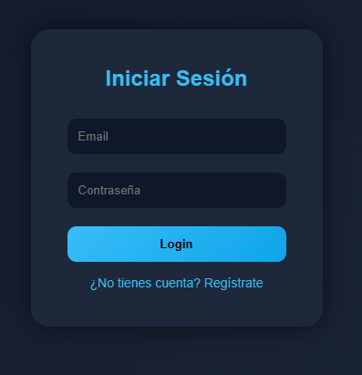
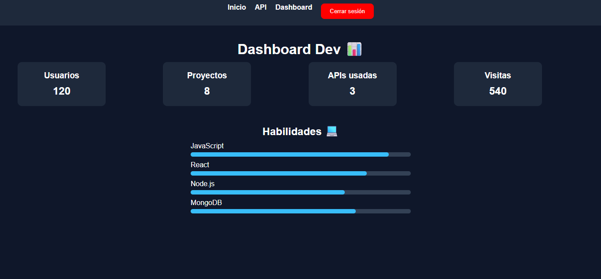
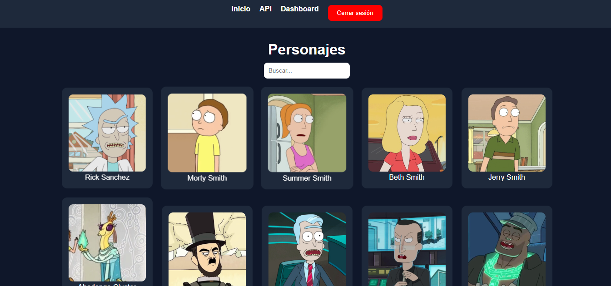

🚀 Proyecto Full Stack: React + Node.js + MongoDB Atlas
📌 Nombre del Proyecto

Sistema Web de Autenticación con Dashboard

📖 Descripción

Este proyecto es una aplicación web desarrollada con React en el frontend y Node.js + Express en el backend, conectada a una base de datos en MongoDB Atlas.

Permite a los usuarios registrarse, iniciar sesión y acceder a un dashboard protegido, implementando validaciones y control de acceso para mejorar la seguridad.

✨ Características principales
🔐 Registro e inicio de sesión de usuarios
👁️ Mostrar/ocultar contraseña (UX mejorada)
✅ Validaciones de formularios
🔒 Protección de rutas (evita acceso sin login)
📊 Dashboard privado para usuarios autenticados
🌐 Consumo de API
🚪 Cierre de sesión seguro
⚡ Interfaz moderna y responsive
⚙️ Instalación
1. Clonar el repositorio
git clone https://github.com/tu-usuario/tu-repo.git
2. Instalar dependencias
🔹 Backend
cd backend
npm install
🔹 Frontend
cd frontend
npm install
▶️ Ejecución del proyecto
🔹 Backend
cd backend
npm run dev
🔹 Frontend
cd frontend
npm run dev
🧪 Variables de entorno

Crear un archivo .env en el backend con:

MONGO_URI=tu_url_de_mongodb_atlas
PORT=5000
🧱 Arquitectura / Encarpetado
📁 Backend
backend/
│── api/
│   └── index.js
│── models/
│   └── User.js
│── routes/
│   └── auth.js
│── .env
│── server.js
📁 Frontend
frontend/
│── public/
│   ├── icon-192.png
│   ├── icon-512.png
│
│── src/
│   ├── assets/
│   ├── components/
│   │   ├── Navbar.jsx
│   │   └── ProtectedRoute.jsx
│   │
│   ├── pages/
│   │   ├── Auth.jsx
│   │   ├── Dashboard.jsx
│   │   ├── Inicio.jsx
│   │   ├── Api.jsx
│   │   └── Register.jsx
│   │
│   ├── App.jsx
│   ├── main.jsx
│
│── vite.config.js
🖼️ Capturas del proyecto
🔐 Login

📊 Dashboard

🌐 API

⚙️ Tecnologías utilizadas
Frontend:
React (Vite)
React Router
Axios
CSS
Backend:
Node.js
Express
MongoDB Atlas
Mongoose
🔐 Seguridad implementada
Validación de campos en formularios
Protección de rutas con ProtectedRoute
Manejo de sesión con localStorage
Restricción de acceso a rutas privadas
👩‍💻 Autor

Juliana Díaz Mesa

📍 Colombia
💻 Desarrolladora en formación
🎯 Enfoque en desarrollo web Full Stack
📌 Notas adicionales

Este proyecto fue desarrollado con fines académicos, aplicando buenas prácticas de desarrollo web, estructura modular y control básico de seguridad en aplicaciones web.

🔥 BONUS (esto te suma puntos con el profe)

Puedes decirle:

👉 “Se implementó protección de rutas para evitar acceso mediante navegación hacia atrás, mejorando la seguridad de la sesión.”